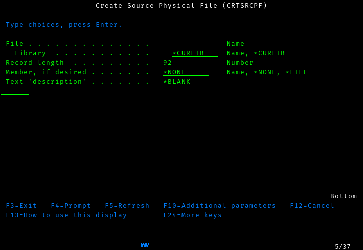
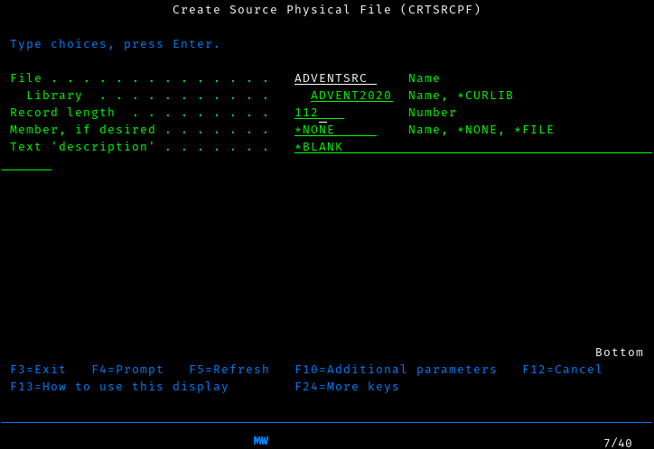
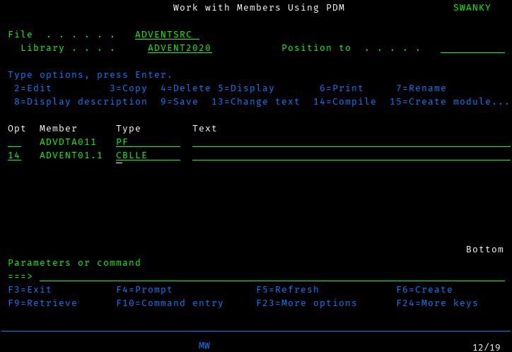
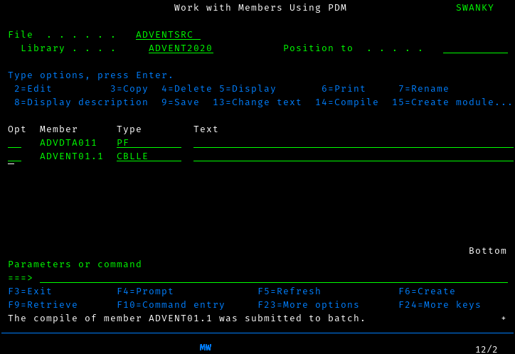
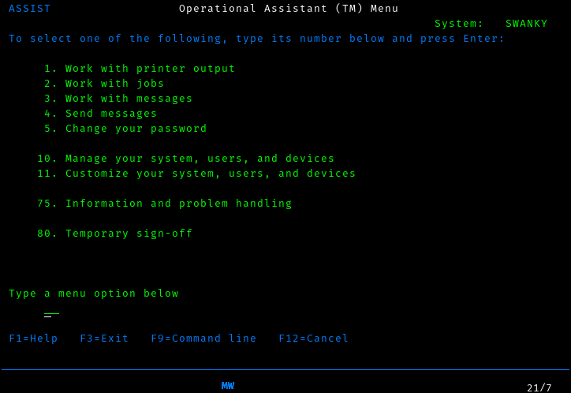
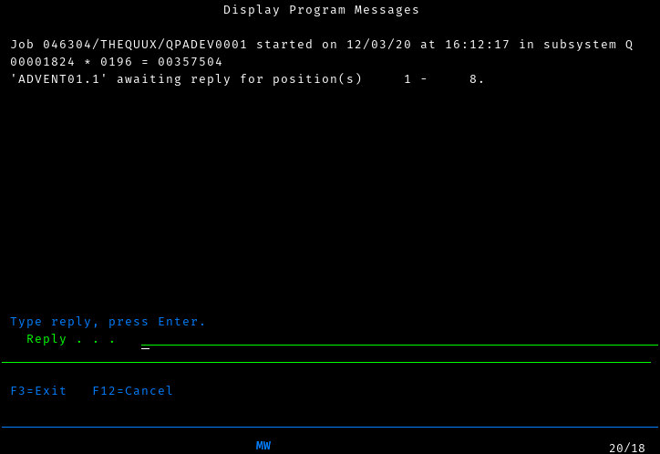

---
categories:
  - ADVENT OF COBOL
date: "2020-12-01"
slug: advent-of-cobol-day-1
title: "ADVENT OF COBOL: Day 1"
description: >-
  Day 1 of Advent of Code 2020, using COBOL on IBM i
tags:
 - COBOL
 - Advent of Code
 - IBM i
---

Every year, Eric Wastl hosts an event called
https://adventofcode.com/2020[Advent of Code], which consists of two
coding challenges per day from the first of december through Christmas
day. The first few challenges tend to be fairly simple, but then they
gradually increase in difficulty through the event.

This makes Advent of Code a wonderful way to learn a new language or
platform, and last year I used it as an excuse to learn Forth. This
year, I decided to try a new system, and wanted something that was
decidedly different from anything I had worked with before. So, of
course I reached for the strangest platform I have access to: COBOL on
IBM i.

IBM i (formerly i5/OS, and before that, AS/400) is IBM’s lesser known
server platform for businesses not large enough to need a mainframe.
They intended it to be a server appliance for small businesses, but
they left the design in the hands of a research team in Rochester, who
came up with a very unusual design. For a start, the primary way that
most users would interact with the system is a "`green screen`" block
mode terminal footnote:[Specifically, it uses a 5250 terminal, similar
in concept but very different in capabilities to the 3270 terminal
used with IBM mainframes.]. When you start trying to write code for
it, the documentation instructs you to first create a "`source
physical file`".  This got me curious what other kinds of files there
were, and after some investigation I realized that "`physical file`"
is the IBM i term for a database table, and "`logical file`" is the
IBM i term for a view. In other words, even your _source code_ is
stored in database tables. The platform is based around a single-level
store, which basically means that every file in the system is
constantly mapped into memory, and always has the same address; to
accomplish this, pointers are 128 bits long and the system has special
hardware to verify that a value in memory is OK to use as a pointer.

In short, we’re not in Kansas anymore.

== Note for people who want to follow along

My hope is that you, dear reader, will be able to follow along on your
own and perhaps learn a new system along with me.

It can be tricky to get access to an IBM i machine, and even once you
do, learning how to operate the editor and operating system will take
some time. I’ll write more about how to take your first steps with IBM i
later, but for now, you can go to https://www.pub400.com[PUB400] and
request a free account. In order to actually use it, you’ll need a 5250
emulator; I recommend either
https://www.ibm.com/support/pages/ibm-i-access-client-solutions[iACS] or
http://tn5250j.org/[tn5250j].

IBM’s documentation for i is very complete, but it was written in a time
when the hardware would come in one box, your 5 meters of documentation
would come in a second, and a friendly field engineer would come in a
third to install the machine for you. As such, you’ll be spending a lot
of time at first just looking through the documentation to find the
details you need.

For today, just go to
https://www.ibm.com/support/knowledgecenter/ssw_ibm_i_74/rzase/esrcst.htm[Compiling,
Running, and Debugging COBOL programs] for a tutorial on operating the
editor and compiler; I’ll try to explain everything else you need. In
the future, I’ll be skipping over the basics and talking only about new
things, so if you find this intolerably slow, it will get better.

== Getting started

Firstly, I needed to get the data into a form that I can use from
IBM i.  Considering that the system really wants to use record-based
I/O footnote:[There are stream files as well, but working them is a
bit of a pain.  Perhaps we’ll use them for a later challenge.], we
first need to create a physical file and load the data into it.

[2] 

We have two options for how to create a physical file. SQL is always an
option, but I prefer the old-fashioned approach (creating data
description specifications), so that’s what we’ll do here.

First, though, we need a source physical file to write our code in, and
it’s probably best to first create a library (akin to a directory in
UNIX or a schema in SQL) to keep everything together. You can create the
library by typing the following command:

[listing.no-outdent]
....
CRTLIB ADVENT2020
....

The command to create a source file is a bit more complex, and it would
be really nice to be able to have an on-screen reference as we put our
command together. Fortunately, i has our back. Just type `+CRTSRCPF+`
and press [.kbd]`F4`. You’ll get the following screen:

It is common to split your source up by the language it’s in. However,
for simplicitly, I’ll just keep all my source in a single file called
`+adventsrc+`. We also want to have somewhat longer lines than the
default, so we’ll create our source file with a record length of 112.

While we could just hit enter here to run the command, it’s worth
examining this screen more closely first, as you’ll be using screens
like this a lot and there’s a lot more you can do here.

First, you’ll notice that there are a list of function keys at the
bottom of the screen, including `+F13+` and `+F24+`. If you look closely
at your keyboard, however, you’ll find that the F keys only go up to 12.
Fortunately, you can reach `+F13+` by pressing `+Shift-F1+`, `+F14+`
using `+Shift-F2+`, all the way up to `+Shift-F12+` for `+F24+`. I’ll
use the names listed on the screen, and let you translate them in your
head, as it’s both good practice and how I think about it in my head.

It’s worth pressing `+F13+` here to see how to use this screen to the
extent of its abilities, but for now just press `+F24+` a few times to
flip through all the keys you have available. Perhaps the most
interesting are `+F9+`, which shows you all the options available to you
(of which there are too many to shake a stick at), and `+F14+`, which
shows you that you could have skipped the entire screen by typing the
command

[listing.no-outdent]
....
CRTSRCPF FILE(ADVENT2020/ADVENTSRC) RCDLEN(112)
....

Once you’re done exploring that screen, press enter to submit the
command, and now we’re ready to start writing our code.

From this point on, I won’t discuss the interface in depth; just know
that you can nearly always get help by pressing `+F1+`, have the system
offer you a prompt by pressing `+F4+`, exit a little by pressing
`+F12+`, or exit a lot by pressing `+F3+`.

To enter the editor, run the command

[listing.no-outdent]
....
strseu srcfile(advent2020/adventsrc) srcmbr(advdta011) type(pf)
....

As you can see, very little is case-sensitive here.

Enter the following code:

[source.dds]
....
     A          R ADVDTA011
     A            DATA           4S
....

This specifies a record format named `+ADVDTA011+` with a single column
named `+DATA+` that is a 4-character-wide decimal. I won’t go into
detail on it, because

. There’s not a lot going on here
. https://www.ibm.com/support/knowledgecenter/ssw_ibm_i_74/rzakb/kickoff.htm[IBM’s
documentation] covers it far better than I could

Next, we need to turn this into an actual physical file:

[listing.no-outdent]
....
crtpf file(advent2020/advdta011) srcfile(advent2020/adventsrc)
....

Now we just need to get our data into this file. There are a variety of
ways to do it, but the way that I did it was to copy the file to my home
directory in PASE (yes, IBM i has a complete UNIX-ish system on the
side, but be warned that it is _very_ strange. For a start, it’s based
on AIX, which is at best maliciously compliant with POSIX).

I got my file in using scp, then used `+cpyfrmimpf+` command to
actually load the data into my physical file (Note: this is formatted
as multiple lines for clarity, but you'll need to enter all of the options on a
single line):

[listing.no-outdent]
....
CPYFRMIMPF FROMSTMF('/home/thequux/advdta011.csv')
           TOFILE(ADVENT2020/ADVDTA011)
           RCDDLM(*ALL)
           MBROPT(*REPLACE)
....

If everything went well, then this should complete successfully. You can
see the data in the file by running `+STRDFU+`, selecting option 5
("`Update data using temporary program`"), and then specifying the name
of the physical file we created earlier.

== I thought this was going to be about COBOL…?

That, unfortunately, is as long as we’re going to be able to
procrastinate; it’s time to grit our teeth and start writing COBOL for
real. This is going to be a bit unpleasant, so we’ll take it piece by
piece.

The structure of a COBOL program is very strictly regimented. Your code
is sorted into divisions, which then are divided into sections, and your
statements only appear within those sections. (well, there are also
paragraphs and sentences, but I don’t understand those divisions
completely, so let’s just ignore them, shall we?)

Create a source member called `+ADVENT01.1+` with type `+CBLLE+` in
`+ADVENT2020/ADVENTSRC+`, and start typing.

=== IDENTIFICATION DIVISION.

This one is very simple, and I hope self-explanatory.

[source,cobol]
....
       IDENTIFICATION DIVISION.
         PROGRAM-ID. "ADVENT01.1".
         AUTHOR. TQ Hirsch.
....

’nuff said.

=== ENVIRONMENT DIVISION.

Here we have two sections:

[source,cobol]
....
      ENVIRONMENT DIVISION.
        CONFIGURATION SECTION.
         SOURCE-COMPUTER. IBM-ISERIES.
         OBJECT-COMPUTER. IBM-ISERIES.
         SPECIAL-NAMES. REQUESTOR IS CONSOLE.
....

To be honest, I copied this directly from the IBM documentation. The
`+SOURCE-COMPUTER+` and `+OBJECT-COMPUTER+` paragraphs are not used for
anything, but they seem to be a sensible place to document exactly
_which_ variant of COBOL we’re using. The `+SPECIAL-NAMES+` paragraph,
though, _does_ do something useful, though we don’t actually take
advantage of it.

It turns out that IBM i has two I/O streams: a system console and the
"`requestor`" (which may be an interactive terminal, or it may be a job
log for batch programs). The declaration `+REQUESTOR IS CONSOLE+`
essentially says "`when I do I/O to CONSOLE, I really mean REQUESTOR.
Don’t bother the sysop with my blathering.`"

As it turns out, we won’t do I/O to CONSOLE in this program, so we don’t
get any benefit from this section at all, so it was a complete waste of
time. Let’s be honest with ourselves, though; you would have used it
reading Hacker News anyway, so nothing of value was lost.

[source,cobol]
....
        INPUT-OUTPUT SECTION.
          FILE-CONTROL.
           SELECT SCAN1 ASSIGN TO DISK-ADVDTA011
             ORGANIZATION IS SEQUENTIAL
             ACCESS MODE IS SEQUENTIAL.
....

Aha! Now we’re getting out of the boilerplate and getting into something
that’s actually relevant to us. This is where we actually define which
files we’re going to be using. Here, we say that we’ll want to access
the file ADVDTA011 using the name SCAN1, and we’ll always start with the
first record in the file and read them in sequence. There are other
types of file organization as well: relative mode lets you jump to
records by number, and indexed mode works lets you access records by
their primary key.

=== DATA DIVISION.

As the name indicates, here’s where we’ll divide up our data.

[source,cobol]
....
       DATA DIVISION.
       FILE SECTION.
        FD SCAN1.
         01 S1DTA PIC 9999.
....

Oh, you thought we were done with files, did you? Nope, we still need to
define what each record looks like. Here we say that the file that we
refer to as SCAN1 has one field, named S1DTA, and it looks like
"`9999`". The PIC keyword, you see, says "`Here’s a picture of what this
data will look like!`", and then we have four 9’s, because we want to be
able to store four digits in it.

[source,cobol]
....
       LOCAL-STORAGE SECTION.
        01 CALC-RESULT PIC 99999999.
        01 PRODUCT PIC 99999999.
        01 NREC PIC 99999 VALUE IS 0.
        01 NUMBERS-TABLE.
        05 SEEN-NUMBERS OCCURS 2020 TIMES PIC 1 VALUE IS B"0".
....

There are two similar sections, `+LOCAL-STORAGE+` and
`+WORKING-STORAGE+`, of which we’ll only use one. Both contain variables
local to the procedure; the main difference between them is that working
storage is shared between all invocations of a procedure, whereas local
storage is specific to the invocation. For our purposes, this
distinction doesn’t matter, but it’s good practice to use local storage
if you can.

To explain our variables, I’ll need to explain the algorithm we’ll be
using. The most obvious algorithm is to test each pair of records; if
they sum to 2020, we’ve found our solution. However, it’s much more
efficient to remember which values we’ve seen and simply check whether
we’ve already seen the other number in the pair.

Thus, we can see what variables we need:

* A pair of variables to store intermediate caluclation results
(`+CALC-RESULT+` and `+PRODUCT+`). Note that these are 8 digits long, so
that we can fit the full product of two 4-digit numbers into it.
* A variable to store the number of input records, for diagnostic
purposes (`+NREC+`).
* Finally, an array of booleans to indicate which values we’ve already
seen (`+PIC 1+` is an IBM extension that stores a boolean).

There is another aspect to all of all of these definitions that I’ve
ignored so far: the level (here, `+01+` and `+05+`). COBOL does support
structures (which it, perhaps confusingly, calls records); each variable
that doesn’t have a level number of `+01+` forms a part of the record
stored in the last variable with a higher record number. The only reason
we use a record here is that, for some reason I don’t understand, the
`+OCCURS+` clause is not valid on variables with a level of `+01+`, but
every variable must be part of a record with level `+01+`.

=== PROCEDURE DIVISION.

Now we get to the meat of our program.

[source,cobol]
....
       PROCEDURE DIVISION.
        MAIN-PROCESSING SECTION.
         SETUP.
           OPEN INPUT SCAN1.
....

Execution starts at the beginning of the procedure division. We’ll only
have one section, which we’ll call `+MAIN-PROCESSING+`; this name is
irrelevant and you can already forget it. Next we start a paragraph
named `+SETUP+`, which makes sense; the first thing we need to do is
open our file for input.

[source,cobol]
....
         MAIN.
           READ SCAN1 NEXT RECORD AT END
             DISPLAY "NO MATCHING VALUES FOUND AFTER " NREC " RECORDS"
             GO TO ENDPGM
           END-READ
....

Oh, now we’re getting to the famous COBOL verbosity.

We have a loop here, although that may not be obvious considering that
the control flow is all done using `+GO TO+`. Each time through the
loop, we try to read a record from `+SCAN1+`. If we reach the end of the
file, we print a diagnostic and bail out.

[source,cobol]
....
           ADD 1 TO NREC GIVING NREC
           IF S1DTA IS GREATER THAN 2020 THEN
             GO TO MAIN
           END-IF
....

We incrememnt the record counter (and find ourselves pining for
`+C+++`), then check whether the record we just read is too large to
possibly be part of a pair that sums to 2020. If so, we simply jump back
to `+MAIN+` to read the next record.

[source,cobol]
....
           SUBTRACT S1DTA FROM 2020 GIVING CALC-RESULT
           IF SEEN-NUMBERS(CALC-RESULT) IS EQUAL TO B"1" THEN
             MULTIPLY CALC-RESULT BY S1DTA GIVING PRODUCT
             DISPLAY CALC-RESULT " * " S1DTA " = " PRODUCT
             GO TO ENDPGM
           END-IF
           MOVE B"1" TO SEEN-NUMBERS(S1DTA)
           GO TO MAIN.
....

First, we compute what number we need to make a winning pair, then check
whether we’ve seen it yet. Of course, you can’t simply _use_ a boolean
as a condition; you need to see if it’s equal to true. Joy.

If we have, in fact, seen the number already, we compute the product of
the number and its pair, and bail out. Otherwise, we remember that we’ve
seen the number and go back to read the next number.

[source,cobol]
....
         ENDPGM.
           ACCEPT CALC-RESULT
           CLOSE SCAN1
           STOP RUN.
....

Here we read a value, to make sure that the person running the program
sees the result, close our file, and exit. In an earlier version, I
failed to close the file first; when I needed to change the format of
the file, that failed because it turns out that open files are shared
across an entire "`activation group`", and the activation group that
this had run in was my login session. Oops. So, close your files when
you’re done with them!

== Compiling and running it

This is easier than you might think; you can type in a compiler command
if you like, but it’s much easier to compile your program using PDM, the
Program Development Manager.

If you haven’t been using it already, start PDM by running

[listing.no-outdent]
....
WRKMBRPDM ADVENT2020/ADVENTSRC
....

Each source member in the file is listed, and you can work with a member
by typing an option into the `+Opt+` field before each member. We want
to compile, which is option `+14+`, so we put that in:

and press enter:

Well that was anticlimatic. In order to see whether that was successful,
we need to look at the printer output. Press the `+ATTN+` key (on most
5250 emulators, this is `+ESC+`, though with TN5250j, you’ll need to map
a key to it because `+ESC+` is normally System Request, which you won’t
use so much. System Request _is_ still useful, so I’d remap that to
`+Shift-ESC+`)

You’ll get the operational assistant menu:

Here you can do two useful things: access your messages (see that `+MW+`
in the status area? That’s your message waiting light) and access
printer output. We’ll start by accessing our messages; here we find out
that our compile succeeded, but there’s no interesting details. For
_those_, we need to look at the printer output. Just clear your messages
using `+F16+` and then back out to the operational assistant menu using
`+F12+`.

Unlike the message display, where the most recent message was clearly at
the top, the printer output display has the most recent prinout at the
bottom. Go there (you may need to page down a few times first), and use
option 5 to display the report and find yourself struck with a sudden
understanding of why greenbar paper was sold in 2000-sheet boxes.

Before we run our program, there is one more thing we need to do. So
far, we’ve been creating all of our files and programs in
`+ADVENT2020+`, but that isn’t actually our current library. Make it so
using

[listing.no-outdent]
....
CHGCURLIB ADVENT2020
....

If we don’t do this, our program will fail to find its input data.

And _now_ we can run the program, using

[listing.no-outdent]
....
CALL ADVENT2020/ADVENT01.1
....

That looks like it worked!

== Task 2

We’ll be able to reuse our data file, but we can no longer use the same
trick to process the file in linear time. There is a nice trick to do it
in quadratic time, by computing a table of pairwise sums and then
finding the third number in the triplet; however, we’ll keep things
simple and use the cubic time algorithm. After all, the data isn’t
particularly large.

We’ll reuse the identification and environment divisions of our first
program, but we’ll need to change our variables a bit:

[source,cobol]
....
       DATA DIVISION.
       FILE SECTION.
        FD SCAN1.
         01 S1DTA PIC 9999.
       LOCAL-STORAGE SECTION.
        01 CALC-RESULT PIC 99999999.
        01 PRODUCT PIC 999999999.
        01 NREC PIC 99999 VALUE IS 0.
        01 DATA-TABLE.
         10 SEEN-NUMBERS PIC 9999 OCCURS 200 TIMES.
         10 IDX0 PIC 999.
         10 IDX1 PIC 999.
         10 IDX2 PIC 999.
....

This time, instead of having a boolean flag for which numbers we’ve
seen, we just load the whole thing into memory (the 200 comes from the
fact that I counted the numbers, and that’s all there was). We’re also
going to need three indices, which we’ll call `+IDX0-3+`

[source,cobol]
....
       PROCEDURE DIVISION.
        MAIN-PROCESSING SECTION.
         SETUP.
           OPEN INPUT SCAN1.
         READ-DATA.
           READ SCAN1 NEXT RECORD AT END
             GO TO FIND-MATCHES
           END-READ
           IF S1DTA IS GREATER THAN 2020 THEN
             GO TO READ-DATA
           END-IF
           ADD 1 TO NREC GIVING NREC
           MOVE S1DTA TO SEEN-NUMBERS(NREC)
           GO TO READ-DATA.
....

The setup paragraph is the same as before, but now we just load the data
into our data array. At the end of the input, we move on to
`+FIND-MATCHES+`.

[source,cobol]
....
         FIND-MATCHES.
           PERFORM VARYING IDX0 FROM 1 BY 1
                   UNTIL IDX0 IS GREATER THAN NREC
             ADD 1 TO IDX0 GIVING CALC-RESULT
             PERFORM VARYING IDX1 FROM CALC-RESULT BY 1
                     UNTIL IDX1 IS GREATER THAN NREC
               ADD 1 TO IDX1 GIVING CALC-RESULT
               PERFORM VARYING IDX2 FROM CALC-RESULT BY 1
                       UNTIL IDX2 IS GREATER THAN NREC
                 MOVE SEEN-NUMBERS(IDX0) TO CALC-RESULT
                 ADD SEEN-NUMBERS(IDX1) TO CALC-RESULT
                 ADD SEEN-NUMBERS(IDX2) TO CALC-RESULT
                 IF CALC-RESULT IS EQUAL TO 2020 THEN
                   MOVE SEEN-NUMBERS(IDX0) TO PRODUCT
                   MULTIPLY PRODUCT BY SEEN-NUMBERS(IDX1) GIVING PRODUCT
                   MULTIPLY PRODUCT BY SEEN-NUMBERS(IDX2) GIVING PRODUCT
                   DISPLAY "VALUES: " SEEN-NUMBERS(IDX0) ","
                                      SEEN-NUMBERS(IDX1) ","
                                      SEEN-NUMBERS(IDX2)
                   DISPLAY "Product is " PRODUCT
                   GO TO ENDPGM
                 END-IF
               END-PERFORM
             END-PERFORM
           END-PERFORM.
....

Whew lads. That looks horrifying, but it’s actually not that bad.
PERFORM is a general purpose control flow statement in COBOL, and here
we’re using it as a roughly C-style for loop. I expect we’ll be seeing
it a lot.

Before each loop, we need to compute the lower bound of the loop,
because COBOL doesn’t have the concept of expressions. Oh well, as
obnoxious bits of languages go, this isn’t so bad. We see more of why
expressions are a really great idea when calculating the sum and
product, but despite being verbose it’s still very clear what’s going
on.

I won’t go any further into this version, because there’s really not
very much going on, and if we compile and execute it like we did the
first version, we get an answer that will give us our second star of the
day.
